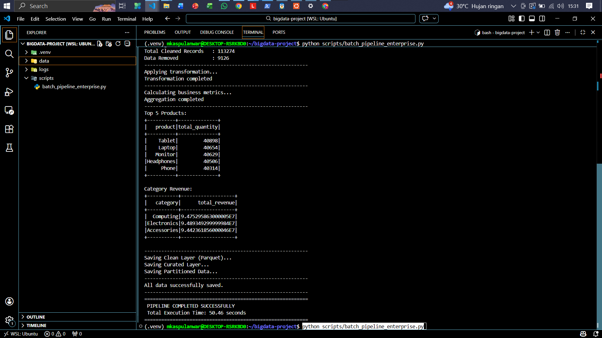

# PRAKTIKUM 2 BATCH DATA INGESTION & PROCESSING WITH SPARK

<p align="center">
  
  
  
  
  
  
</p>

## Deskripsi Praktikum

Praktikum Week 2 ini berfokus pada Batch Data Ingestion dan Processing menggunakan Apache Spark melalui PySpark dengan pendekatan enterprise workflow. Kamu memproses dataset transaksi e commerce dari format CSV dengan tahap ingestion, pembersihan dan validasi data, transformasi, serta agregasi untuk menghasilkan metrik bisnis yang siap analitik. Hasil pemrosesan disimpan ke Data Lake berlapis raw clean curated menggunakan format Parquet yang lebih efisien, sekaligus menerapkan partitioning agar pembacaan data lebih optimal. Seluruh pekerjaan dijalankan di Ubuntu environment melalui WSL dan dikembangkan dengan VS Code Remote WSL, serta menggunakan Python venv untuk menjaga dependency tetap rapi dan konsisten.

---

## Tim Developer

| Peran | Nama | NIM | Profil GitHub |
| :--- | :--- | :--- | :--- |
| **Pengembang Proyek** | M. Kaspul Anwar | 230104040212 | [](https://github.com/mkaspulanwar) |
| **Dosen Pengampu** | Muhayat, M. IT | - | [](https://github.com/muhayat-lab) |

---

## Tujuan Praktikum
Setelah praktikum ini, kamu diharapkan mampu:

1. Menggunakan **Linux environment melalui WSL** sebagai lingkungan kerja data engineering yang menyerupai server production.
2. Mengintegrasikan **VS Code Remote WSL** agar proses coding di Windows tetapi eksekusi dan file system berjalan di Linux environment.
3. Mengelola **Python virtual environment (venv)** untuk menjaga dependency project tetap konsisten, rapi, dan reproducible.
4. Mengimplementasikan **batch ingestion** menggunakan Spark, mulai dari membaca data CSV skala besar menjadi DataFrame.
5. Melakukan **data cleaning dan transformation** secara terstruktur untuk meningkatkan kualitas data sebelum dianalisis.
6. Mendesain struktur **Data Lake berlapis** dengan konsep **Raw Clean Curated** agar data mudah ditelusuri, diaudit, dan dipelihara.
7. Menggunakan format **Parquet** sebagai output utama untuk efisiensi ukuran file dan kecepatan baca pada analitik.
8. Menerapkan **partitioning strategy** untuk mengoptimalkan performa query dan meminimalkan I O melalui partition pruning.
9. Menghasilkan pipeline yang lebih **enterprise ready**, bukan sekadar script berjalan, tetapi memiliki alur jelas, output terstandar, dan praktik terbaik pengolahan data.

---

## Gambaran Arsitektur Pipeline
Pipeline yang dibangun mengikuti alur batch processing berlapis. Alur ini memisahkan data berdasarkan tingkat “kematangan” data sehingga setiap layer punya fungsi yang jelas.

### Diagram Pipeline
```text
                 ┌──────────────────────────┐
                 │   CSV Source Dataset      │
                 │   ecommerce_raw.csv       │
                 └─────────────┬────────────┘
                               │
                               ▼
                 ┌──────────────────────────┐
                 │        RAW LAYER          │
                 │   data/raw (CSV)          │
                 │   Data mentah disimpan    │
                 └─────────────┬────────────┘
                               │
                               ▼
                 ┌──────────────────────────┐
                 │  CLEANING & VALIDATION    │
                 │  - drop duplicates        │
                 │  - handle nulls           │
                 │  - filter nilai invalid   │
                 │  - parse tanggal          │
                 └─────────────┬────────────┘
                               │
                               ▼
                 ┌──────────────────────────┐
                 │     TRANSFORMATION        │
                 │  - feature engineering    │
                 │  - contoh: total_amount   │
                 └─────────────┬────────────┘
                               │
                               ▼
                 ┌──────────────────────────┐
                 │       CLEAN LAYER         │
                 │   data/clean (Parquet)    │
                 │   Data bersih & konsisten │
                 └─────────────┬────────────┘
                               │
                               ▼
                 ┌──────────────────────────┐
                 │ CURATED LAYER (AGGREGATE) │
                 │ data/curated (Parquet)    │
                 │ - revenue per category    │
                 │ - top products            │
                 │ - avg transaction/customer│
                 └─────────────┬────────────┘
                               │
                               ▼
                 ┌──────────────────────────┐
                 │   PARTITIONED DATA LAKE   │
                 │  clean/partitioned_by_*   │
                 │  Optimasi query & storage │
                 └──────────────────────────┘
```
## Konsep yang Dipakai
1. Batch Processing: data diproses dalam satu run (tidak real time).
2. Distributed Computing: Spark membagi pekerjaan ke beberapa core/worker (di praktikum ini local mode).
3. Medallion Architecture: Raw (bronze), Clean (silver), Curated (gold) untuk memisahkan kualitas dan fungsi data.
4. Columnar Storage (Parquet): format kolom yang efisien untuk analitik dan kompresi.
5. Partition Pruning: optimasi baca saat query hanya membaca partisi yang relevan.

## Struktur Folder Project
Struktur folder mengikuti standar data lake berlapis agar alur kerja jelas dan mudah dikembangkan.
```markdown
bigdata-project/
├── .venv
├── screenshots
├── data/
│   ├── raw/                          # Data mentah (CSV) sebagai source of truth
│   ├── clean/                        # Data bersih (Parquet) termasuk output partisi
│   │   ├── parquet/                  # Output clean utama dalam Parquet
│   │   └── partitioned_by_category/  # Output clean yang dipartisi (contoh: category)
│   └── curated/                      # Dataset terkurasi (hasil agregasi/metrik bisnis)
│       ├── category_revenue/         # Revenue per category
│       ├── top_products/             # Top produk terlaris
│       └── avg_transaction/          # Rata-rata transaksi per customer
├── logs/                             # Log eksekusi pipeline untuk debugging dan audit
└── scripts/                          # Script PySpark pipeline
    └── batch_pipeline_enterprise.py  # Script utama Week 2
```

## Bukti Screenshots

Berikut dokumentasi proses praktikum Big Data:

<table>
<tr>
<td align="center"><b>Spark berhasil berjalan</b></td>
</tr>
<tr>
<td></td>
</tr>
</table>

---

## Setup Environment dan Cara Menjalankan Pipeline

Bagian ini menjelaskan setup environment praktikum menggunakan **Ubuntu environment melalui WSL**, pengembangan dengan **VS Code Remote WSL**, serta dependency yang dibutuhkan untuk menjalankan **PySpark batch pipeline**. Ikuti langkah di bawah secara berurutan agar environment konsisten dan pipeline bisa dijalankan tanpa error. :contentReference[oaicite:0]{index=0}

### 1) Install dan Konfigurasi WSL Ubuntu Environment

1. Buka **PowerShell** sebagai Administrator, lalu install WSL:
```bash
wsl --install
```
2. Jika Ubuntu belum terpasang, install distro Ubuntu:
```bash
wsl --install -d Ubuntu
```
3. Restart Windows jika diminta. Setelah itu, jalankan Ubuntu pertama kali:
    - Buka Start Menu → cari Ubuntu
    - Buat username dan password
    - Jika berhasil, prompt akan terlihat seperti: `username@DESKTOP:~$`
### 2) Install Dependency di Ubuntu (WSL)
Di terminal Ubuntu jalankan:
1. Update package:
```bash
sudo apt update && sudo apt upgrade -y
```
2. Install Java 17 (wajib untuk Spark karena Spark berjalan di JVM):
```bash
sudo apt install openjdk-17-jdk -y
java -version
```
3. Install Python dan tools untuk venv:
```bash
sudo apt install python3-full python3-venv python3-pip -y
```

### 3) Buat Struktur Project
Buat folder project dan struktur data lake:
```bash
cd ~
mkdir -p bigdata-project/{data/raw,data/clean,data/curated,logs,scripts}
cd bigdata-project
```
### 4) Setup VS Code Remote WSL
1. Install VS Code di Windows
2. Install extension:
    - WSL (Microsoft)
    - Python (Microsoft)
3. Buka VS Code dalam mode WSL:
    - Tekan `Ctrl + Shift + P`
    - Pilih WSL: New Window
    - Open Folder ke: `/home/<username>/bigdata-project`
    - Jika pojok kiri bawah tertulis `WSL: Ubuntu`, artinya VS Code sudah terhubung ke WSL.

### 5) Buat dan Gunakan Virtual Environment (venv)
Dari root folder project `~/bigdata-project`:
1. Buat venv:
```bash
python3 -m venv venv
```
2. Aktifkan venv:
```bash
source venv/bin/activate
```
3. Upgrade pip dan install PySpark:
```bash
pip install --upgrade pip
pip install pyspark
```
4. (Opsional) Simpan dependency untuk reproducibility:
```bash
pip freeze > requirements.txt
```
5. Pastikan VS Code memakai interpreter venv:
    - `Ctrl + Shift + P`
    - `Python: Select Interpreter`
    - Pilih `venv/bin/python`

### 6) Letakkan Dataset
1. Masuk ke folder raw:
```bash
cd ~/bigdata-project/data/raw
pwd
```
2. Buka folder tersebut di Windows Explorer:
```bash
explorer.exe .
```
3. Copy file dataset ke folder ini dengan nama: `ecommerce_raw.csv`
    - Sehingga path dataset menjadi: `data/raw/ecommerce_raw.csv`

## Cara Menjalankan Pipeline
1. Masuk ke root project:
```bash
cd ~/bigdata-project
```
2. Aktifkan venv:
```bash
source venv/bin/activate
```
3. Pastikan script utama ada di: `scripts/batch_pipeline_enterprise.py`
4. Jalankan pipeline: `python scripts/batch_pipeline_enterprise.py`

## Output yang Diharapkan
Setelah pipeline sukses, minimal folder berikut akan terbentuk
    - `data/clean/parquet/`
    - `data/clean/partitioned_by_category/`
    - `data/curated/category_revenue/`
    - `data/curated/top_products/`
    - `data/curated/avg_transaction/`
